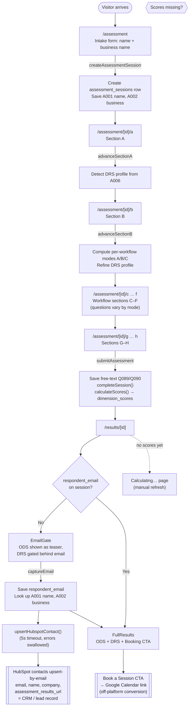

# Application Flow

This document outlines the end-to-end flow of the Ownership Debt Assessment app:
from landing on the intake form through completing the assessment, capturing an
email, recording the lead in the CRM, and booking a consultation.

## High-level flow



## Sequence: email capture → CRM record

```mermaid
sequenceDiagram
    participant U as User
    participant EG as EmailGate (client)
    participant CA as captureEmail (server action)
    participant DB as Supabase
    participant HS as upsertHubspotContact
    participant CRM as HubSpot (CRM)

    U->>EG: Enter email, submit
    EG->>EG: Validate ("@" and ".")
    EG->>CA: captureEmail(sessionId, email)
    CA->>DB: UPDATE assessment_sessions SET respondent_email
    CA->>DB: Read A001 (name) + A002 (business) answers
    CA->>HS: upsertHubspotContact(sessionId, email, fullName, companyName)
    Note over CA,HS: Wrapped in Promise.race with 5s timeout;<br/>errors logged, never block the UI
    HS->>HS: Build contact properties:<br/>email, firstname/lastname, company,<br/>assessment_results_url → /admin/sessions/[id]
    HS->>CRM: POST /crm/v3/objects/contacts/batch/upsert<br/>(idProperty: email, Bearer token)
    CRM-->>HS: 2xx / error (logged only)
    CA-->>EG: return
    EG->>U: Unlock full results + Booking CTA
```

## Key steps

| Stage | Entry point | What happens |
| --- | --- | --- |
| **Intake** | `src/app/assessment/page.tsx` → `createAssessmentSession` (`actions.ts`) | Creates session, saves name (A001) + business (A002), redirects to Section A. |
| **Sections A–H** | `src/app/assessment/[sessionId]/{a…h}/page.tsx` | Answers saved as-you-go via `saveRadioAnswer`. Section A sets DRS profile; Section B computes per-workflow modes that branch questions in C–F. |
| **Submit** | `submitAssessment` (`actions.ts:144`) | Saves free-text (Q089/Q090), `completeSession()`, `calculateScores()` → `dimension_scores`, redirects to results. **No webhook here.** |
| **Results** | `src/app/results/[sessionId]/page.tsx` | Loads scores. No scores → Calculating page. Has email → `FullResults`; no email → `EmailGate`. |
| **Email capture** | `captureEmail` (`results/[sessionId]/actions.ts`) | Saves `respondent_email`, looks up name/business answers, syncs to HubSpot (5s timeout, errors swallowed). |
| **CRM record** | `upsertHubspotContact` (`src/lib/hubspot.ts`) | Upserts a HubSpot contact by email (email, first/last name, company, `assessment_results_url` → admin results page). No scores sent. Requires `HUBSPOT_ACCESS_TOKEN` + `APP_BASE_URL`. |
| **Conversion** | `BookingCTA` (`EmailGate.tsx`) | "Book a Session" → Google Calendar link. No in-app payment; the sale happens in the booked call. |

## Notes & caveats

- **CRM record is tied to the email gate, not to completion.** A completed assessment
  with no email entered stores scores in Supabase but sends **nothing** to the CRM.
  The HubSpot sync has exactly one trigger: `captureEmail`.
- **Fire-and-forget delivery.** The HubSpot call runs under a 5s timeout with
  swallowed errors — a CRM outage silently drops the lead (visible only in server
  logs). No retry or queue. The email is still saved in Supabase, so it could be
  re-driven.
- **HubSpot sync is a no-op without env config.** If `HUBSPOT_ACCESS_TOKEN` or
  `APP_BASE_URL` is unset (e.g. local dev), `upsertHubspotContact` returns early.
- **No scores go to HubSpot.** The contact carries only identity fields plus
  `assessment_results_url` (a custom single-line-text contact property) linking to
  `/admin/sessions/[sessionId]`, which is behind admin login. Scores stay in
  Supabase.
- **Email validation is superficial** — client-side `includes('@')` only; no
  server-side validation before persisting or sending onward.
- **"Purchase" is a booking, not a transaction.** Conversion is a Google Calendar
  consultation link; monetization happens off-platform.
