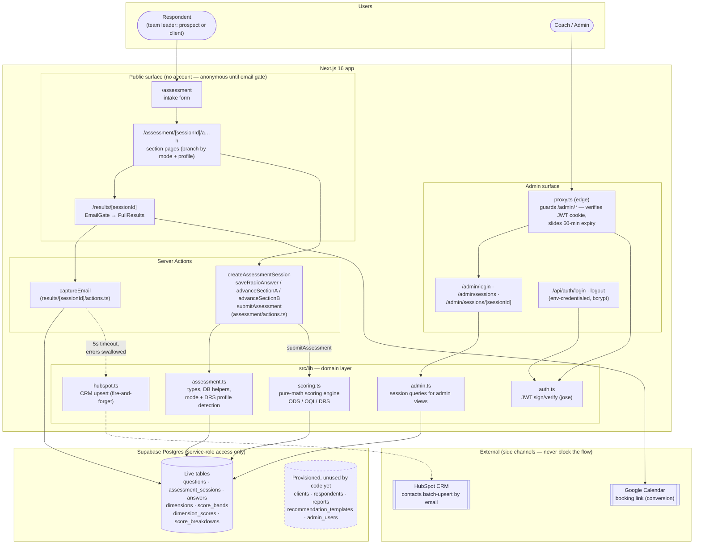
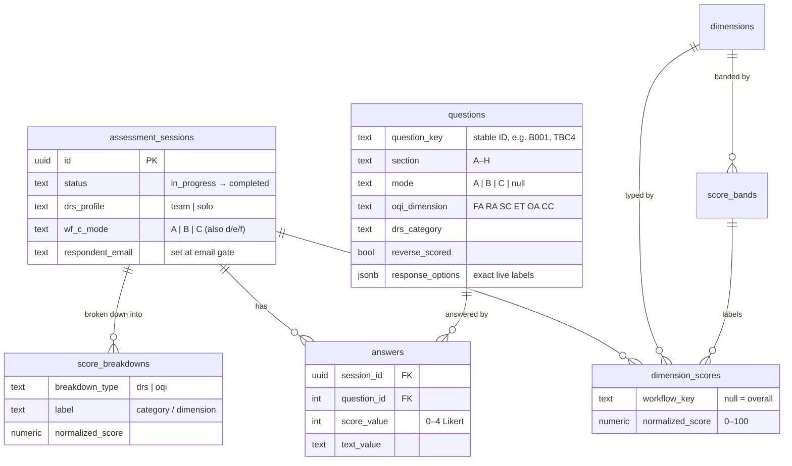
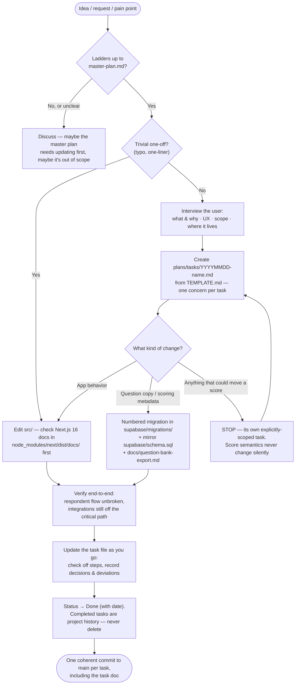

# Architecture & Operating Workflow

_Companion to [master-plan.md](master-plan.md) (the "why") and
[application-flow.md](application-flow.md) (the in-app respondent flow step by
step). This doc answers three questions, in order of altitude: **what is the
client's journey** (the product operating workflow), **how is the system built**
(architecture), and **how do we change it** (dev workflow)._

## The client journey

One person, two chapters: the **team leader** arrives as a prospect and — if
coaching works out — becomes a coaching client using the same instrument over
time. Solid arrows are live today; dashed arrows are the target state from the
[master plan](master-plan.md).

```mermaid
flowchart LR
    subgraph P1["① Prospect — live today"]
        direction TB
        Mkt([Marketing touch]) --> Take["Takes assessment<br/>anonymous, no account"]
        Take --> Teaser["Sees Ownership Debt<br/>score (teaser)"]
        Teaser --> Email["Trades email for<br/>full breakdown + DRS"]
        Email --> Book["Books a consultation<br/>(Google Calendar)"]
    end

    subgraph P2["② Sale — live today, off-platform"]
        direction TB
        Call["Consultation call —<br/>coach works from the<br/>admin session page"]
        Call --> Sign["Signs up<br/>(DIY program / coaching)"]
        Call -.->|no signup| Nudge["30-day nudge:<br/>retake & compare —<br/>is it more urgent now?"]
    end

    subgraph P3["③ Coaching client — target state"]
        direction TB
        Base["Prospect assessment<br/>= the baseline<br/>(no fresh intake retake)"]
        Base -.-> Work["Work one workflow<br/>(Listing Launch, Seller Comm,<br/>File Opening, Lender Tracking)"]
        Work -.->|workflow completed| Push["Coach pushes the<br/>next assessment"]
        Push -.-> Retake["Client retakes<br/>(emailed link, no login)"]
        Retake -.-> Delta["Results show movement:<br/>per-workflow ODS ↓, DRS ↑"]
        Delta -.-> Work
        Retake -.-> Review["Coach reviews progress<br/>across all their clients"]
    end

    Book --> Call
    Sign -.-> Base
    Nudge -.-> Take
```

The retake cadence lines up with the instrument: the scoring engine already
computes **per-workflow ODS** (a `dimension_scores` row per workflow C–F), so a
retake after completing a workflow directly measures the workflow that was just
coached — the delta is attributable, not vague.

What the system does at each stage (client-visible vs. behind the scenes):

| Stage | The client experiences | Behind the scenes | Status |
| --- | --- | --- | --- |
| Takes assessment | ~10-min branching questionnaire that speaks their language (Listing Launch, TCs) | Session + answers saved as they go; questions branch on who owns each workflow | **Live** |
| Sees teaser → email gate | ODS score free; full breakdown costs an email | Scores computed once at submit; email saved to the session | **Live** |
| Email captured | Nothing — no interruption | HubSpot contact upserted (name, company, results link); coach/sales sees the lead | **Live** |
| Consultation call | Coach discusses their specific results | Coach works from the admin session page (linked from the HubSpot contact). **Known gaps:** (a) single env-credentialed admin — no master admin who can add users as the team grows (`admin_users` is the landing zone); (b) the page shows scores but not enough answer-level insight to really drive the call — needs diagnostics / "how we can help" content (`recommendation_templates` is the landing zone) | **Live — needs work** |
| No signup → nurture | 30 days later, an invitation to retake and see what's changed — especially how urgent it feels now (Section H reflections) | Scheduled email with a retake link tied to their earlier session | **Target** |
| Baseline | Their pre-sale assessment *is* the starting measurement — no retake at engagement start | Sessions linked to a person (keyed off email at first) — `respondents` comes alive | **Target** |
| Retakes | After finishing each workflow, a fresh assessment arrives by email — click the link, no login | Coach hits "send retake" on the client's page; a tokenized link opens a new session pre-linked to the same respondent | **Target** |
| Progress view | Each retake's results page shows movement vs. baseline and last time — per score and per workflow | Delta view over the linked sessions' `dimension_scores` | **Target** |
| Coach review | Progress discussed with real numbers in coaching sessions | Admin becomes the coach's surface: client roster, history, trends; master admin manages coach accounts | **Target** |

## System architecture (current)

One Next.js 16 app (App Router, Server Actions, edge `proxy.ts`) in front of one
Supabase Postgres database. All database access goes through the **service-role
client on the server** — the browser never talks to Supabase directly, and there
are no client-side API keys beyond the public URL. External integrations
(HubSpot, Google Calendar) hang off the side and are never on the respondent's
critical path.

Key structural facts:

- **Questions live in the database, not in code.** The app renders whatever
  `questions` holds (`fetchQuestions` filters by section, mode, and DRS
  profile). Copy and scoring metadata change via numbered migrations in
  `supabase/migrations/`, mirrored in `supabase/schema.sql` and
  `docs/question-bank-export.md`.
- **Branching state lives on the session row.** `assessment_sessions` carries
  `drs_profile` (from A006, refined after Section B) and `wf_c_mode…wf_f_mode`
  (from B001–B004 via `answerToMode`). Section pages C–F read these to decide
  which question variant (Mode A / B / C) to render.
- **Scoring is pure math with one write.** `calculateScores()`
  ([scoring.ts](../src/lib/scoring.ts)) reads answers + question metadata,
  computes ODS/OQI/DRS, then delete-and-inserts `dimension_scores` and
  `score_breakdowns`. No AI, no side effects beyond that write. It runs exactly
  once, inside `submitAssessment`.
- **The CRM sync has exactly one trigger:** `captureEmail`. It is wrapped in a
  5-second `Promise.race` with swallowed errors — a HubSpot outage can silently
  drop the lead, but the email always survives in Supabase. No scores go to
  HubSpot; the contact carries identity fields plus an `assessment_results_url`
  pointing at the (login-gated) admin session page.
- **Admin auth is env-credentialed MVP.** One admin (env `ADMIN_EMAIL` /
  `ADMIN_PASSWORD`, bcrypt-checked), JWT in an httpOnly cookie, sliding 60-min
  expiry enforced at the edge by `proxy.ts`. The `admin_users` table exists for
  named multi-admin later.
- **A whole slice of the schema is dormant on purpose.** `clients`,
  `respondents`, `reports`, and `recommendation_templates` have no code
  references yet — they are provisioned landing zones for the coaching-tool
  vision (see below), not live features.

### Data model (live tables)

### Where the vision lands (target deltas)

The [master plan](master-plan.md) roadmap maps onto the architecture like this —
each theme is a delta to the diagram above, not a rewrite:

| Roadmap theme | Architectural change |
| --- | --- |
| **1. Stabilize what's shipped** | No structural change — prod env for HubSpot, verify pass, OQI dimension relabel (migration only; slugs and grouping untouched). |
| **2. Retakes & progress** | The dormant `respondents` table comes alive: link `assessment_sessions` to a person (keyed off captured email at first). New retake entry point on the public surface; `/results` grows a delta view comparing `dimension_scores` across a respondent's sessions. This is the main structural gap today — nothing currently links two sessions. |
| **3. Coach-facing views** | The admin surface evolves from an inspection tool into the coach's working surface: `clients` table live, per-client history and dimension trends read across linked sessions. Admin auth likely graduates from env creds to `admin_users`. |

## Operating workflow

How a change moves from idea to `main`. The repo is its own tracker — the task
file, not chat history, is the record.

### Guardrails (the principles, operationalized)

| Principle | What it means in practice |
| --- | --- |
| **The respondent's flow is sacred** | Anything external runs as a side channel: timeout + swallowed error (see `captureEmail`'s 5s `Promise.race` around the HubSpot call). A new integration must never add an `await` that can fail on the intake → sections → results path. |
| **Scores are a measurement instrument** | Never rename a slug to mean something new, never regroup questions under a dimension in passing. Any change that could move a number gets its own task with that as the stated scope — comparability across retakes is the product. |
| **Questions live in the database** | Don't hardcode question copy in components. Change flow: migration → apply → mirror `schema.sql` → regenerate `docs/question-bank-export.md`. `question_key` values are stable forever. |
| **Low friction first** | No accounts on the public surface. Identity is introduced only where the coaching vision demands it (linking retakes), starting from the captured email — not as a login gate. |
| **Work against a task** | Every non-trivial change starts as a task doc laddering up to the master plan. Interview before transcribing; split unrelated asks into separate tasks. |

### Change types at a glance

| You want to change… | Mechanism | Watch out for |
| --- | --- | --- |
| Question wording, options, ordering | Migration + schema mirror + export doc | Reusing a `question_key` or changing what a question measures — that's a score-semantics change |
| Scoring formulas / weights | Task explicitly scoped to it; edit `scoring.ts` constants | Silently breaking comparability with past sessions |
| App flow / UI | Task + code in `src/` | Next.js 16 differs from training data — read `node_modules/next/dist/docs/` first |
| Integrations (CRM, email) | Task + side-channel pattern | Never on the critical path; no-op cleanly when env vars are unset |
| Env / config | `.env` (`SUPABASE_*`, `JWT_SECRET`, `ADMIN_*`, `HUBSPOT_ACCESS_TOKEN`, `APP_BASE_URL`) | HubSpot sync silently no-ops without its two vars |
