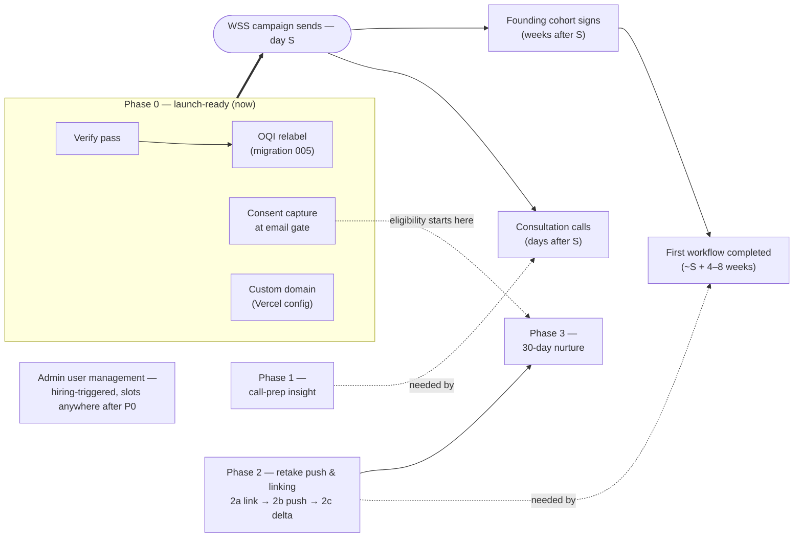

# Implementation Plan

_Last updated: 2026-07-18_

_Sequencing companion to [master-plan.md](master-plan.md) (why) and
[architecture.md](architecture.md) (what/how it's built). This doc holds the
**order, dependencies, and decision gates** — the task docs in
[tasks/](tasks/) hold the per-task detail. Update this doc when a phase
completes or a gate resolves._

## The clock driving the order

The [WSS launch email campaign](tasks/20260718-wss-launch-email-campaign.md)
(in flight — copy drafted, awaiting review) sets real deadlines. Call the send
date **S**:

- **Days after S:** campaign-driven consultation calls happen — the admin
  session page is the coach's working surface for them.
- **Weeks after S:** 5–10 founding cohort members sign — their pre-sale
  assessments become baselines.
- **~4–8 weeks after S:** the first cohort member completes their first
  workflow — the retake push needs to exist by then.

One subtlety discovered while planning: respondents are only eligible for
future VAI-sent email (the 30-day nurture) if they **consented at the email
gate** — and today's gate captures no consent at all. Consent capture is tiny,
but it must ship **before S** or the entire campaign wave is permanently
ineligible for nurture. That pulls it into Phase 0.

## Phase 0 — Stabilize & launch-ready

Everything the campaign send waits on. Order within the phase matters for the
first two: the verify pass establishes what state the live DB is actually in
(including whether migration 004 ever ran) before migration 005 stacks on top.

1. **[Verify shipped assessment changes](tasks/20260717-verify-shipped-assessment-changes.md)**
   (not started) — prove migration 004, role intros, the solo/team race fix,
   and the email gate against live Supabase. No code expected; defects spawn
   tasks.
2. **[OQI dimension relabel](tasks/20260717-oqi-dimension-relabel.md)**
   (in progress — naming decisions locked) — migration 005 + `scoring.ts` +
   admin display names + docs. Must land before cohort baselines are discussed
   with clients: honest dimension names are a prerequisite for showing anyone
   their breakdown. Exit check: a pre-migration session's scores are
   byte-identical after.
3. **[Consent capture at the email gate](tasks/20260718-email-gate-consent-capture.md)**
   (✅ done 2026-07-19, live in prod and verified end-to-end) — disclosure
   text at the gate, `consented_at` column (migration 006), HubSpot
   `email_consent_date` property. Consent eligibility runs from the
   2026-07-20T03:26Z deploy onward; earlier respondents stay off-limits.
4. **Custom domain** — `ownership-assessment-delta.vercel.app` → a real domain
   before marketing email links to it (flagged in the campaign task; small
   Vercel config change, no task doc needed unless it grows).
5. **Campaign copy review + send coordination** — Bri + WSS, no code
   ([campaign task](tasks/20260718-wss-launch-email-campaign.md)).

**Phase exit:** campaign is cleared to send.

## Phase 1 — Call-prep insight

**[Admin call-prep insight](tasks/20260718-admin-call-prep-insight.md)** —
needed by the first campaign-driven calls, so it runs immediately after (or
overlapping) Phase 0. Starts with the interview of Bri (what does a coach need
on screen mid-call?), then builds answer-level views and seeds
`recommendation_templates`. Display-only — no scoring changes — so it can ship
incrementally right up to call day.

**Phase exit:** Bri runs a real consultation call from the page and it answers
"how do we actually help this person."

## Phase 2 — Retake push & respondent linking

**[Retake push & linking](tasks/20260718-retake-push-and-linking.md)** — the
structural core, needed by the first completed cohort workflow. Three slices,
in order (each becomes its own task doc when picked up):

- **2a — Linking.** Smaller than it looks: `assessment_sessions` *already has*
  `respondent_id` and `client_id` FK columns and the `respondents` table
  exists — no structural migration. Work = create/match respondents on email
  capture (keyed by email) + backfill past gated sessions. Can start before
  the email-provider decision.
- **2b — Push.** ⛔ Gated on the **email provider decision** (the app sends no
  email today). Coach's "send retake" button → tokenized link → new session
  pre-linked to the respondent. Baseline rule is already decided: the pre-sale
  session is the baseline; retakes fire after each completed workflow.
- **2c — Delta view.** Results page shows movement vs. baseline and vs.
  previous — per score and per workflow (per-workflow ODS rows make the delta
  attributable to the workflow just coached).

**Phase exit:** the full loop demoed — coach pushes, client retakes via
emailed link with no login, delta renders on results.

## Phase 3 — 30-day nurture

**[30-day nurture retake](tasks/20260718-30-day-nurture-retake.md)** — same
push mechanism as 2b on a timer, so it follows Phase 2 cheaply. Gates: the
"didn't sign up" signal definition, nudge copy, a scheduler (nothing runs on a
timer today), and — hard requirement — recipients must have consented (Phase
0's consent capture defines the eligible pool).

## Flexible track — Admin user management

**[Admin user management](tasks/20260718-admin-user-management.md)** — no
dependency on any phase (master-admin-sets-password avoids even the email
provider). Trigger is the hiring timeline: the moment a second person needs to
run calls or review clients, it jumps to the front of whatever phase is
running. Watch for it during Phase 1–2 — a growing cohort is exactly when help
gets hired.

## Decision gates

| Gate | Decided by | Blocks | Status |
| --- | --- | --- | --- |
| Campaign copy + send date | Bri + WSS | Day S (everything downstream) | Open |
| Call-prep interview (what's on screen during a call?) | Bri | Phase 1 build | Open — can happen any time |
| Consent mechanism + copy | Bri | Phase 0 item 3 | **Resolved 2026-07-18** — by-submission disclosure; draft copy in the task doc, final wording pass pending |
| Email provider for app-sent mail | Bri + dev | 2b, Phase 3 | Open — WSS's platform covers only *their* sends |
| "Didn't sign up" signal | Bri | Phase 3 | Open |
| Coach roles & visibility scope | Bri | User management build | Open — only when hiring nears |

## Out of band

Not sequenced here, tracked in the master plan's rough list: durable CRM
delivery (outbox/retry for HubSpot), server-side email validation, results
emails, richer HubSpot data. They graduate into tasks when they start to hurt.
